<div align="center">


# Erebus

### One desktop app for your message brokers — and for the agent working beside you

**Apache Kafka** and **RabbitMQ** in a single native window. Browse topics and queues, produce and consume,
manage consumer groups, schemas, connectors and bindings. Keep your `kubectl port-forward`s alive in built-in
terminal tabs. Then hand the whole thing to Claude Code over MCP.

<br>

[](https://github.com/Elkhan-Isayev/erebus/releases/latest)
[](LICENSE)
[](https://github.com/Elkhan-Isayev/erebus/releases)

[**Download**](#-download) · [**Features**](#-features) · [**MCP for Claude Code**](#-mcp--claude-code-drives-erebus) · [**Terminal**](#-terminal) · [**Development**](#-development)

<br>

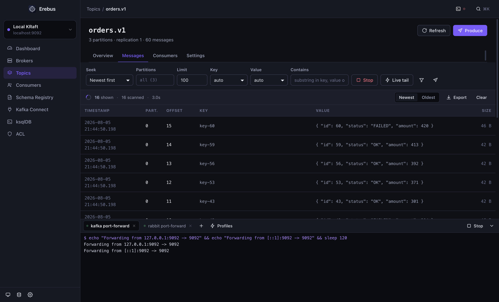

</div>

<br>

## ⬇ Download

No runtime, no Docker, no server to deploy. Pick your platform and open the app.

<div align="center">

| | Platform | Download |
|:--:|:--|:--|
| 🍎 | **macOS** · Apple Silicon | [](https://github.com/Elkhan-Isayev/erebus/releases/latest/download/Erebus-mac-arm64.dmg) |
| 🍎 | **macOS** · Intel | [](https://github.com/Elkhan-Isayev/erebus/releases/latest/download/Erebus-mac-x64.dmg) |
| 🪟 | **Windows** · installer | [](https://github.com/Elkhan-Isayev/erebus/releases/latest/download/Erebus-win-x64-setup.exe) |
| 🪟 | **Windows** · portable | [](https://github.com/Elkhan-Isayev/erebus/releases/latest/download/Erebus-win-x64-portable.exe) |
| 🪟 | **Windows** · ARM64 | [](https://github.com/Elkhan-Isayev/erebus/releases/latest/download/Erebus-win-arm64-setup.exe) |
| 🐧 | **Linux** · AppImage | [](https://github.com/Elkhan-Isayev/erebus/releases/latest/download/Erebus-linux-x86_64.AppImage) |
| 🐧 | **Linux** · Debian, Ubuntu | [](https://github.com/Elkhan-Isayev/erebus/releases/latest/download/Erebus-linux-amd64.deb) |
| 🐧 | **Linux** · Fedora, RHEL | [](https://github.com/Elkhan-Isayev/erebus/releases/latest/download/Erebus-linux-x86_64.rpm) |
| 🐧 | **Linux** · ARM64 | [](https://github.com/Elkhan-Isayev/erebus/releases/latest/download/Erebus-linux-arm64.AppImage) [](https://github.com/Elkhan-Isayev/erebus/releases/latest/download/Erebus-linux-arm64.deb) |

Everything else — checksums, zip and tar.gz — is on the [**releases page**](https://github.com/Elkhan-Isayev/erebus/releases/latest).

</div>

> [!NOTE]
> The builds are **not code-signed**. On macOS, right-click the app → *Open* the first time, or run
> `xattr -cr /Applications/Erebus.app`. On Linux, `chmod +x Erebus-linux-x86_64.AppImage` before launching.

<br>

## ✦ Why Erebus

Web-based broker UIs need a server, a deployment, and a network path from that server to your brokers.
Erebus is the same toolbox as a desktop app: it connects **from your laptop**, with **your** credentials, and
nothing ever leaves the machine.

<table>
<tr>
<td width="33%" valign="top">

### 🧩 Two brokers, one app
Apache Kafka (and API-compatible brokers such as Redpanda, MSK and Confluent) next to RabbitMQ. Same navigation, same
message viewer, same muscle memory.

</td>
<td width="33%" valign="top">

### 🖥 Terminal tabs inside
`kubectl port-forward` where you actually need it. Save profiles and mark them **auto-start**, and the tunnels are up
before the window has finished painting.

</td>
<td width="33%" valign="top">

### 🤖 An MCP server
Point Claude Code at Erebus and it gets **46 tools** — inspect, produce, consume, operate, port-forward. Read-only
clusters stay read-only for the agent too.

</td>
</tr>
<tr>
<td valign="top">

### 🔒 Local by construction
No telemetry, no backend, no account. Secrets go into the OS keychain; the rest is one JSON file you can export
without them.

</td>
<td valign="top">

### 🌗 Light and dark
Follows the system by default, switchable with `⌘⇧L`. Every screen, every table, every terminal, both ways.

</td>
<td valign="top">

### 🛡 Read-only mode
Mark production read-only and produce, delete, purge and offset resets are refused **in the main process** — not
merely greyed out in the UI.

</td>
</tr>
</table>

<div align="center">

<br><em>RabbitMQ overview, with two <code>kubectl port-forward</code> tabs running underneath</em>
</div>

<br>

## ✦ Features

### 

<table>
<tr>
<td width="50%" valign="top">
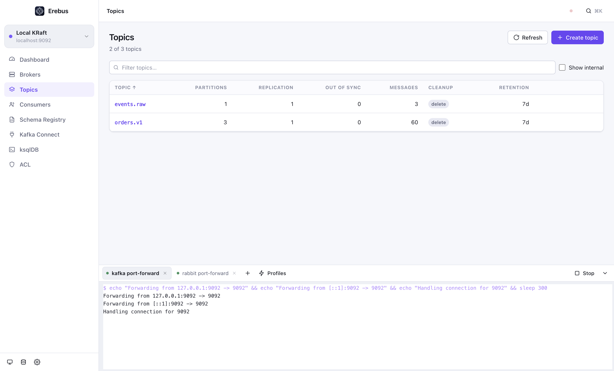
</td>
<td width="50%" valign="top">
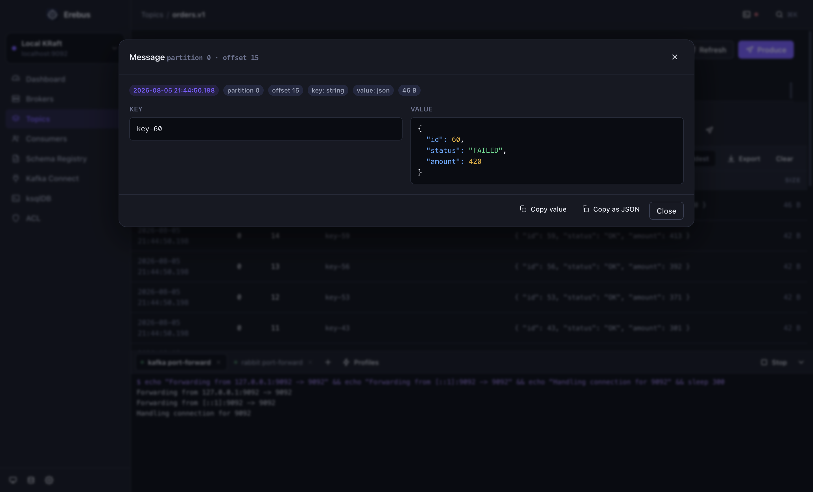
</td>
</tr>
</table>

| Area | What you get |
| --- | --- |
| **Cluster** | Dashboard with brokers, partitions, under-replicated and offline counts, message totals and the controller. Every broker's effective configuration, searchable. SASL `PLAIN` / `SCRAM-SHA-256` / `SCRAM-SHA-512`, TLS with custom CA, client certificate and key. |
| **Topics** | Sortable list with partitions, replication factor, out-of-sync replicas, message count, cleanup policy and retention. Create with arbitrary config, edit config inline, add partitions, purge records, delete (typed confirmation). Partition table with leader, replicas, ISR and offsets. |
| **Messages** | Seek by **newest / oldest / offset / timestamp**, all partitions or a subset. Deserializers: auto, `string`, `json`, **Avro through the Schema Registry**, JSON Schema, `base64`, `hex`, `int32`, `int64`. Substring search **plus a sandboxed JavaScript filter**. **Live tail.** Export the result set as JSON. |
| **Produce** | Key and value serializers (including Avro against a registered subject), headers, target partition, compression, null keys. |
| **Consumer groups** | State, members, assignments, per-partition committed offset, end offset and lag. Reset to earliest, latest, an offset or a timestamp. Delete a group. |
| **Schema Registry** | Subjects, versions, highlighted schema. Register AVRO / JSON / PROTOBUF, check compatibility first, change the compatibility level, delete a version or a subject. |
| **Kafka Connect** | Several Connect workers per cluster. State, class, topics, task health. Pause, resume, restart, restart a single task, edit config, create, delete — with failure traces in place. |
| **ksqlDB** | Any statement with `⌘↵`; results as a table, plus the raw response when you need it. |
| **ACL** | Every rule with principal, permission, operation, resource and pattern type. Create and delete. |

<details>
<summary><b>The JavaScript message filter</b> — the feature you will use most</summary>

<br>

Each message is evaluated in a `node:vm` sandbox with a timeout. `value` and `key` arrive already parsed when they are
JSON, `headers` is a flat object:

```js
value.status === 'FAILED' && value.amount > 1000
headers.source === 'checkout-api'
key.startsWith('tenant-42:')
message.partition === 3 && Number(message.offset) > 10_000
```

Combine it with a seek position and a limit and you have a targeted scan instead of a wall of output.

</details>

<br>

### 

Erebus speaks the **management plugin's HTTP API**, so there is nothing to install beyond what the management UI
already requires — and no AMQP client in the bundle.

<table>
<tr>
<td width="50%" valign="top">
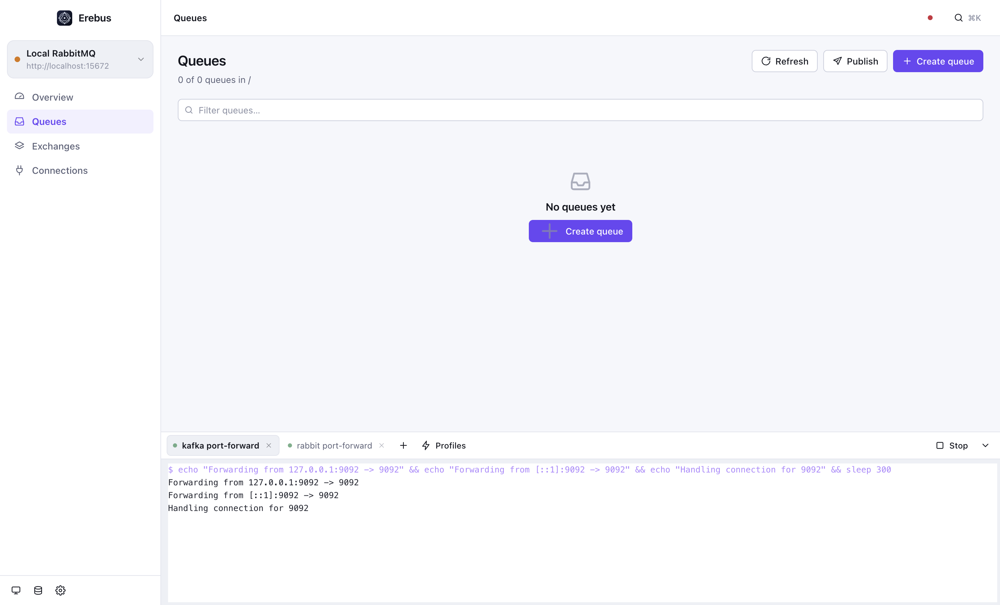
</td>
<td width="50%" valign="top">
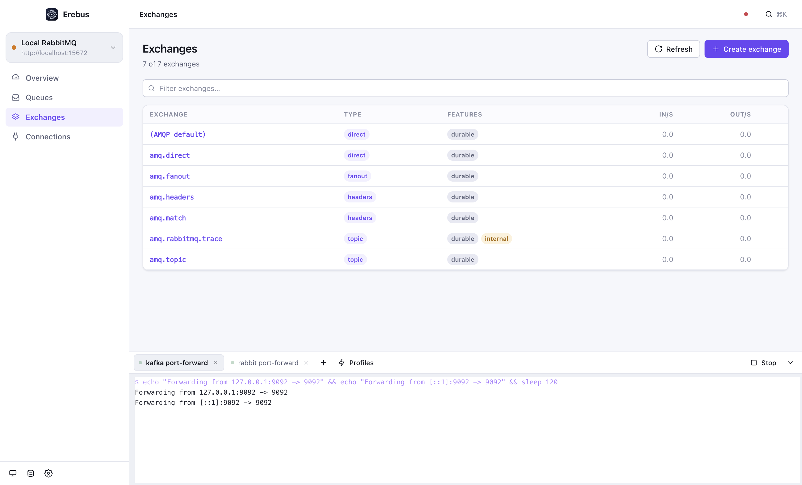
</td>
</tr>
</table>

| Area | What you get |
| --- | --- |
| **Overview** | Nodes with memory, disk and uptime. Ready and unacknowledged totals, object counts, publish and deliver rates, listeners and virtual hosts. |
| **Queues** | State, type, durability, ready/unacked, consumers and rates. Create, purge, delete. **Peek** at messages (put straight back) or **consume** them (acknowledged and gone) — payload, properties and headers included. |
| **Exchanges** | Type, durability, rates. Create and delete. See every binding on an exchange and bind a queue with a routing key from the same view. |
| **Publish** | To any exchange with a routing key, or to the default exchange to hit a queue by name. Content type, delivery mode, headers, base64 payloads — and Erebus tells you when a message was published but **routed nowhere**. |
| **Connections** | Clients with peer, user, vhost, protocol, TLS and channel count. Channels with prefetch and unacked counts. Consumers with tags and ack mode. Close a connection when you must. |

<br>

### 🖥 Terminal

<div align="center">
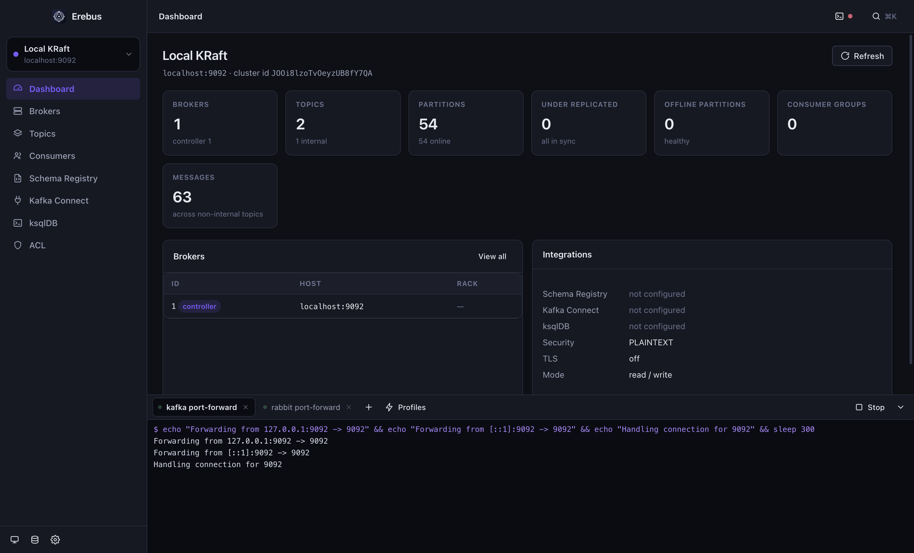
</div>

An IDE-style panel at the bottom of the window — <kbd>⌘</kbd><kbd>`</kbd> to show it, <kbd>⌘</kbd><kbd>T</kbd> for a new tab.

- Commands run through your **login shell**, so `PATH`, `kubectl` contexts and everything in your profile are exactly
  what a normal terminal would give you.
- **Profiles** — saved commands, usually port-forwards. Mark one **auto-start** and Erebus runs it in its own tab on
  every launch, so your brokers are reachable before you click anything.
- <kbd>Ctrl</kbd><kbd>C</kbd> signals the whole **process group**, so a port-forward really stops. Command history with
  <kbd>↑</kbd><kbd>↓</kbd>, ANSI colours, and scrollback that survives navigating around the app.

<details>
<summary>Configure profiles</summary>

<br>

<div align="center">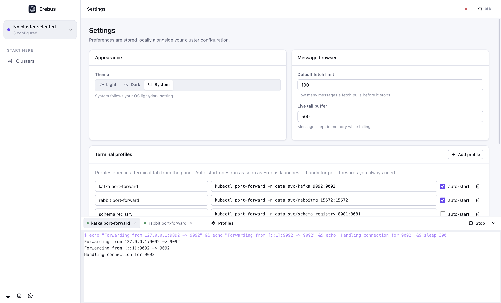</div>

Or let the agent do it: `terminal_save_profile` with `autoStart: true`.

</details>

> [!NOTE]
> These are pipes, not a pty — ideal for CLIs and long-running port-forwards, not for full-screen TUIs like `vim` or `htop`.

<br>

## 🤖 MCP — Claude Code drives Erebus

Erebus doubles as a [Model Context Protocol](https://modelcontextprotocol.io) server over stdio. Register it once:

```bash
claude mcp add erebus -- /Applications/Erebus.app/Contents/MacOS/Erebus --mcp
```

<details>
<summary>Other platforms, and manual configuration</summary>

<br>

```jsonc
// .mcp.json in your project, or ~/.claude.json
{
  "mcpServers": {
    "erebus": {
      // macOS:        /Applications/Erebus.app/Contents/MacOS/Erebus
      // Linux:        /path/to/Erebus-linux-x86_64.AppImage
      // Windows:      C:\\Users\\<you>\\AppData\\Local\\Programs\\Erebus\\Erebus.exe
      // From source:  "command": "npx", "args": ["electron", ".", "--mcp"]
      "command": "/Applications/Erebus.app/Contents/MacOS/Erebus",
      "args": ["--mcp"],
      "env": {
        "EREBUS_MCP_READONLY": "0" // set to 1 to hide every mutating tool
      }
    }
  }
}
```

</details>

The server reuses the connections you configured in the app — keychain secrets included — and calls the **same IPC
handlers the UI does**, so the agent can never do something the app cannot, or slip past a read-only cluster.

<div align="center">

| Area | Tools |
| :-- | :-- |
| **Connections** | `list_clusters` · `add_cluster` · `remove_cluster` · `test_cluster` |
| **Kafka cluster** | `cluster_overview` · `list_brokers` · `get_broker_config` |
| **Kafka topics** | `list_topics` · `describe_topic` · `create_topic` · `delete_topic` · `update_topic_config` · `add_partitions` · `purge_topic` |
| **Kafka messages** | `consume_messages` · `produce_message` |
| **Kafka groups** | `list_consumer_groups` · `describe_consumer_group` · `reset_consumer_group_offsets` · `delete_consumer_group` |
| **Schemas** | `list_schema_subjects` · `get_schema` · `register_schema` |
| **Connect** | `list_connectors` · `get_connector` · `control_connector` |
| **ksqlDB · ACL** | `ksql_execute` · `list_acls` |
| **RabbitMQ** | `rabbit_overview` · `rabbit_list_queues` · `rabbit_describe_queue` · `rabbit_get_messages` · `rabbit_publish` · `rabbit_manage_queue` · `rabbit_list_exchanges` · `rabbit_manage_exchange` · `rabbit_list_bindings` · `rabbit_bind` · `rabbit_list_connections` |
| **Terminal** | `terminal_list` · `terminal_run` · `terminal_output` · `terminal_stop` · `terminal_list_profiles` · `terminal_save_profile` · `terminal_delete_profile` |

</div>

So you can simply ask:

> *"Port-forward staging Kafka, then show me the last 20 messages on `orders.v1` where status is FAILED."*
>
> *"Publish this payload to the `orders` exchange with routing key `orders.created` and tell me whether it routed."*
>
> *"Which consumer group is lagging, on which partitions, and since when?"*
>
> *"Set up a port-forward profile for the schema registry and start it on every launch."*

<br>

## ✦ More of the app

<table>
<tr>
<td width="50%" valign="top" align="center">
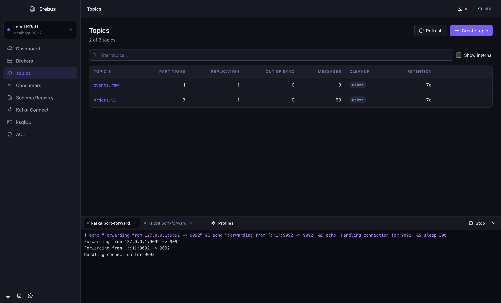<br>
<b>Command palette</b> — <kbd>⌘</kbd><kbd>K</kbd> to any topic, page or cluster
</td>
<td width="50%" valign="top" align="center">
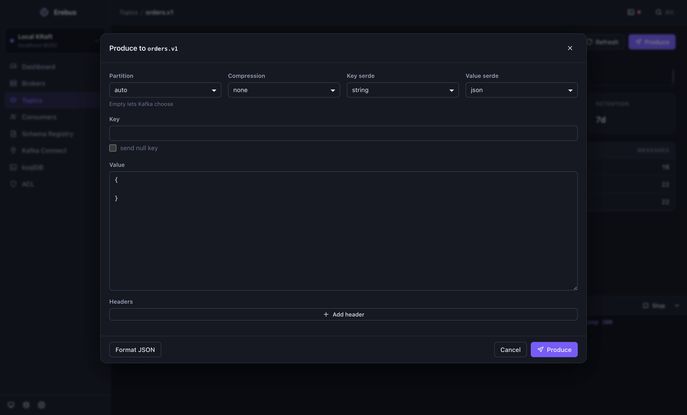<br>
<b>Produce</b> — serializers, headers, partition, compression
</td>
</tr>
<tr>
<td width="50%" valign="top" align="center">
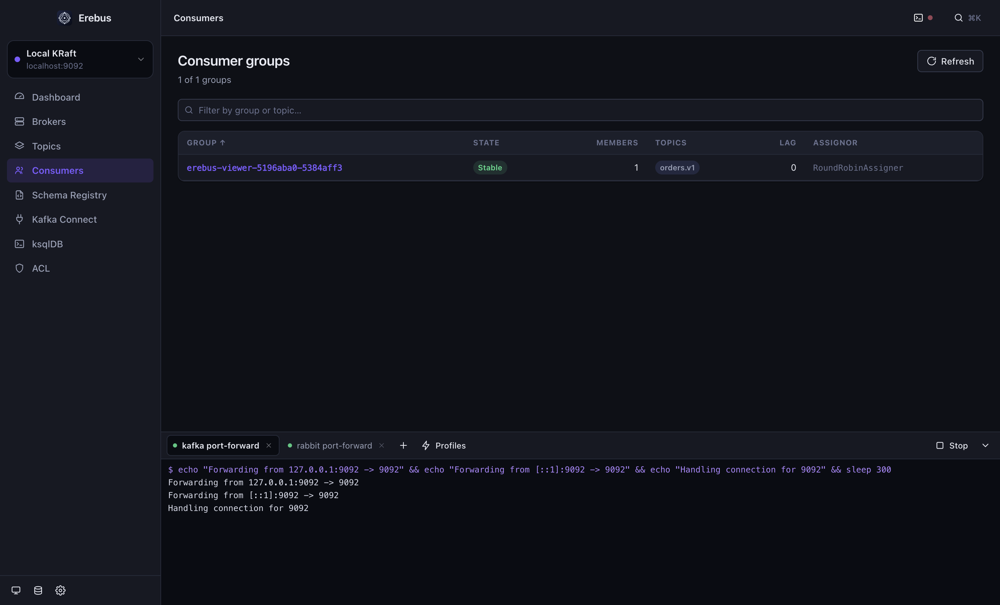<br>
<b>Consumer groups</b> — state, members, topics, lag
</td>
<td width="50%" valign="top" align="center">
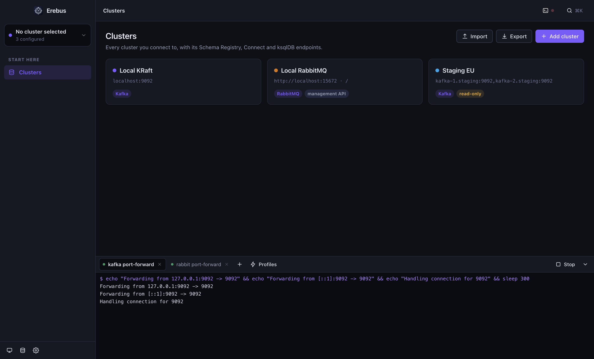<br>
<b>Connections</b> — Kafka and RabbitMQ side by side
</td>
</tr>
</table>

<br>

## ✦ Getting started

1. Launch Erebus and click **Add cluster**.
2. Choose **Apache Kafka** or **RabbitMQ**.
   - *Kafka* — bootstrap servers (`broker-1:9092,broker-2:9092`), then SASL/TLS under **Security** and Schema Registry,
     Kafka Connect or ksqlDB under **Integrations**.
   - *RabbitMQ* — the management URL (`http://localhost:15672`), user, password and virtual host.
3. Hit **Test connection**, then **Add cluster**.

Tick **read-only** for production. Produce, publish, create, delete, config changes and offset resets are then rejected
in the main process, so neither a stray click nor an over-eager agent can reach the broker.

### Keyboard

| Shortcut | Action |
| --- | --- |
| <kbd>⌘</kbd><kbd>K</kbd> | Command palette — jump to any topic, page or cluster |
| <kbd>⌘</kbd><kbd>`</kbd> | Show or hide the terminal panel |
| <kbd>⌘</kbd><kbd>T</kbd> | New terminal tab |
| <kbd>⌘</kbd><kbd>⇧</kbd><kbd>L</kbd> | Cycle light → dark → system |
| <kbd>⌘</kbd><kbd>N</kbd> | New cluster |
| <kbd>⌘</kbd><kbd>R</kbd> | Refresh the current view |
| <kbd>⌘</kbd><kbd>↵</kbd> | Execute the ksqlDB statement |

<sub>Use <kbd>Ctrl</kbd> instead of <kbd>⌘</kbd> on Windows and Linux.</sub>

### Where your data lives

| Platform | Path |
| --- | --- |
| macOS | `~/Library/Application Support/Erebus/erebus.config.json` |
| Windows | `%APPDATA%\Erebus\erebus.config.json` |
| Linux | `~/.config/Erebus/erebus.config.json` |

Passwords, client keys and passphrases are encrypted with the OS keychain (`safeStorage`) before they are written —
Keychain on macOS, DPAPI on Windows, libsecret (GNOME Keyring / KWallet) on Linux. Where no keyring exists, Erebus falls
back to a `0600` file; treat that machine accordingly. **Export** writes the same file with the secrets stripped, so a
set of connections is safe to share.

<br>

## ✦ Cross-platform by construction

Everything ships as one Electron app with **no native modules** — the same JavaScript runs everywhere, so there is no
per-arch rebuild and no prebuilt binary to trust. The platform differences that do exist are handled explicitly:

| | 🍎 macOS | 🪟 Windows | 🐧 Linux |
| --- | --- | --- | --- |
| **Packages** | dmg, zip · x64 + arm64 | NSIS installer, portable · x64 + arm64 | AppImage, deb, rpm, tar.gz · x64 + arm64 |
| **Terminal shell** | `$SHELL -l -c` | `%COMSPEC% /d /s /c` | `$SHELL -l -c` |
| **Stopping a command** | SIGINT to the process group | `taskkill /t` over the tree | SIGINT to the process group |
| **Secret storage** | Keychain | DPAPI | libsecret, else a `0600` file |
| **Window chrome** | hidden inset title bar | native | native |

<br>

## ✦ Development

```bash
npm install        # also generates build/icon.png from pure maths
npm run dev        # Vite + Electron with hot reload
npm run typecheck  # renderer and main process
npm run build      # bundle renderer (Vite) and main/preload (esbuild)
npm run dist       # package installers for the current OS into release/
npm run mcp        # build, then serve MCP on stdio
```

Brokers to develop against:

```bash
docker run -p 9092:9092 apache/kafka:3.9.0
docker run -p 5672:5672 -p 15672:15672 rabbitmq:3-management
```

### Architecture

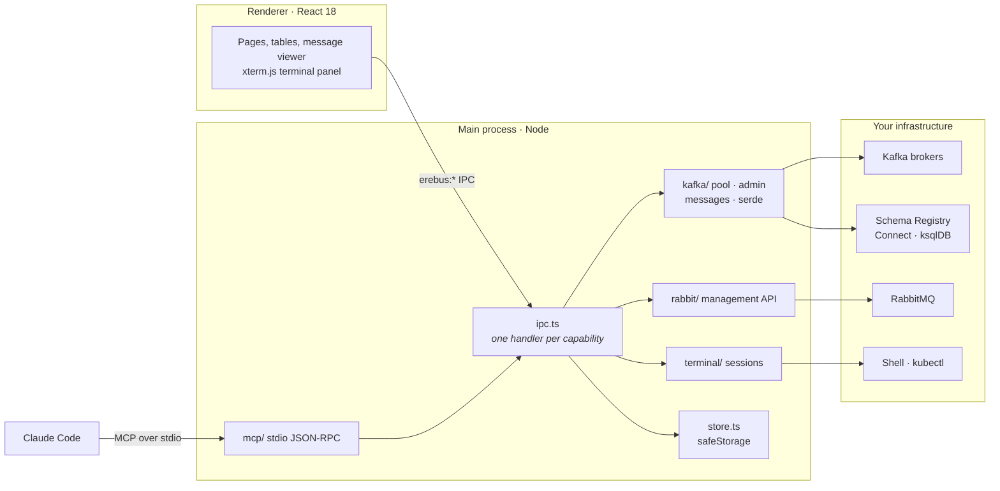

```
electron/            main process — nothing here is reachable from the page
  kafka/pool.ts        cached clients, admin and producer per cluster
  kafka/admin.ts       topics, brokers, configs, groups, ACLs
  kafka/messages.ts    the consume engine (seek, filter, live tail) and produce
  kafka/serde.ts       decoding, incl. Confluent wire format + Avro
  rabbit/api.ts        RabbitMQ over the management HTTP API
  rest/                Schema Registry, Kafka Connect and ksqlDB clients
  terminal/manager.ts  sessions, scrollback and process groups
  mcp/                 stdio JSON-RPC server and the 46-tool catalogue
  store.ts             connections, encrypted with safeStorage
  ipc.ts               the single surface the UI and MCP both call
src/                 renderer — React 18, no UI framework, hand-written CSS
  app/                 shell, routing, theme, global state
  pages/               one file per screen (pages/rabbit/* for RabbitMQ)
  components/          primitives: table, modal, toast, palette, terminal
shared/types.ts      the contract between the two sides
```

The renderer runs with `contextIsolation` on and `nodeIntegration` off; it reaches the outside world only through the
`erebus:*` channels. Connections, credentials, decoding and child processes all stay in the main process.

Browsing Kafka messages uses a transient consumer group named `erebus-viewer-*`, created for the scan and deleted when
it finishes — Erebus never commits offsets on your groups.

### Release

Tag and push. GitHub Actions builds macOS, Windows and Linux and attaches every artifact to the release:

```bash
npm version minor
git push --follow-tags
```

<br>

## ✦ Acknowledgements

Inspired by [provectus/kafka-ui](https://github.com/provectus/kafka-ui), and by every hour anyone has spent staring at
`kafka-console-consumer`. Built on [KafkaJS](https://kafka.js.org/), [Electron](https://electronjs.org),
[xterm.js](https://xtermjs.org) and [Vite](https://vite.dev). Named after Erebus, the primordial darkness — which is
roughly what an unobserved message queue is.

<br>

<div align="center">

**[Apache 2.0](LICENSE)** · Built by [Elkhan Isayev](https://github.com/Elkhan-Isayev)

<sub>If Erebus saves you a port-forward, a ⭐ is appreciated.</sub>

</div>
