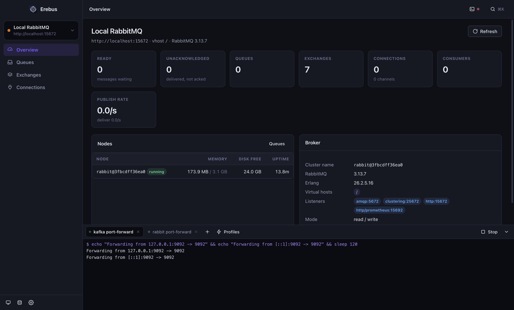
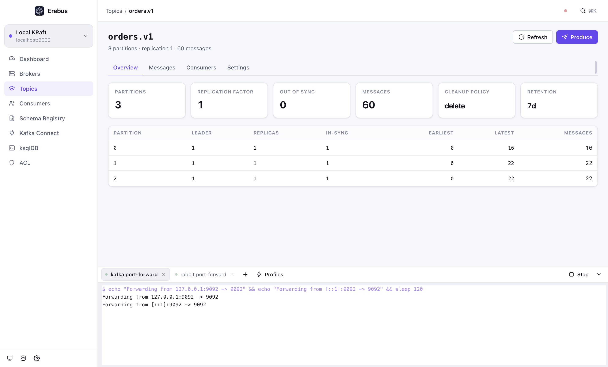

<div align="center">

# Erebus

**One desktop app for your message brokers — and for the agent working alongside you.**

Browse topics and queues, produce and consume messages, manage consumer groups, schemas, connectors and bindings.
Keep your `kubectl port-forward`s running in built-in terminal tabs. Hand the whole thing to Claude Code over MCP.

[](https://github.com/Elkhan-Isayev/erebus/releases/latest)
[](LICENSE)
[](#download)
[](#features)


</div>

## Download

Grab the build for your machine — no runtime, no Docker, no server to deploy.

| Platform | Download |
| --- | --- |
| **macOS** (Apple Silicon) | [Erebus-mac-arm64.dmg](https://github.com/Elkhan-Isayev/erebus/releases/latest/download/Erebus-mac-arm64.dmg) |
| **macOS** (Intel) | [Erebus-mac-x64.dmg](https://github.com/Elkhan-Isayev/erebus/releases/latest/download/Erebus-mac-x64.dmg) |
| **Windows** (installer) | [Erebus-win-x64-setup.exe](https://github.com/Elkhan-Isayev/erebus/releases/latest/download/Erebus-win-x64-setup.exe) |
| **Windows** (portable) | [Erebus-win-x64-portable.exe](https://github.com/Elkhan-Isayev/erebus/releases/latest/download/Erebus-win-x64-portable.exe) |
| **Windows** (ARM64) | [Erebus-win-arm64-setup.exe](https://github.com/Elkhan-Isayev/erebus/releases/latest/download/Erebus-win-arm64-setup.exe) |
| **Linux** (AppImage) | [Erebus-linux-x64.AppImage](https://github.com/Elkhan-Isayev/erebus/releases/latest/download/Erebus-linux-x64.AppImage) |
| **Linux** (Debian/Ubuntu) | [Erebus-linux-x64.deb](https://github.com/Elkhan-Isayev/erebus/releases/latest/download/Erebus-linux-x64.deb) |
| **Linux** (Fedora/RHEL) | [Erebus-linux-x64.rpm](https://github.com/Elkhan-Isayev/erebus/releases/latest/download/Erebus-linux-x64.rpm) |
| **Linux** (ARM64) | [AppImage](https://github.com/Elkhan-Isayev/erebus/releases/latest/download/Erebus-linux-arm64.AppImage) · [deb](https://github.com/Elkhan-Isayev/erebus/releases/latest/download/Erebus-linux-arm64.deb) |

Every artifact is on the [releases page](https://github.com/Elkhan-Isayev/erebus/releases/latest).

> **The builds are not code-signed.** On macOS, right-click the app → *Open* the first time, or run
> `xattr -cr /Applications/Erebus.app`. On Linux, `chmod +x Erebus-linux-x64.AppImage` before launching.

## Why Erebus

Web-based broker UIs need a server, a deployment, and a network path from that server to your brokers.
Erebus is the same toolbox as a desktop app: it connects from your laptop with your own credentials, keeps
every connection local, and stores secrets in the OS keychain.

- **Several brokers, one app** — Apache Kafka (and API-compatible brokers) and RabbitMQ, side by side.
- **Terminal tabs built in** — run `kubectl port-forward` where you actually need it, and have it up before you are.
- **An MCP server** — point Claude Code at Erebus and it can inspect, produce, consume and operate everything you can.
- **Read-only mode** — mark production read-only and every destructive action is refused in the main process, not just greyed out.
- **Light and dark themes** — follows your OS by default, toggle with `⌘⇧L` / `Ctrl+Shift+L`.
- **Everything local** — no telemetry, no cloud, no backend. Configuration lives in a single JSON file you can export.

<div align="center">

</div>

## Features

### Apache Kafka

**Cluster** — dashboard with brokers, partitions, under-replicated and offline partition counts, message totals and
controller; every broker's effective configuration; SASL `PLAIN` / `SCRAM-SHA-256` / `SCRAM-SHA-512` and TLS with a
custom CA, client certificate and key.

**Topics** — sortable, filterable list with partitions, replication factor, out-of-sync replicas, message count,
cleanup policy and retention. Create topics with arbitrary configuration, edit configuration inline, add partitions,
purge records, delete. Per-topic partition table with leader, replicas, ISR and offsets, plus the consumer groups
reading it and their lag.

**Messages** — seek by **newest**, **oldest**, **offset** or **timestamp**, across all partitions or a chosen subset.
Deserializers: automatic detection, `string`, `json`, **Avro via Schema Registry** (Confluent wire format), JSON Schema,
`base64`, `hex`, `int32`, `int64`. Substring search plus a **JavaScript filter** evaluated per message in a sandbox —
`value.status === 'FAILED' && headers.source === 'api'`. **Live tail** streams new records as they arrive. Produce with
key/value serializers (including Avro against a registered subject), headers, target partition and compression.

**Consumer groups** — state, members, assignments, per-partition committed offset, end offset and lag; reset offsets to
earliest, latest, an offset or a timestamp; delete a group.

**Schema Registry** — subjects, versions, full schema with highlighting; register AVRO / JSON / PROTOBUF schemas, check
compatibility first, change the compatibility level, delete versions or subjects.

**Kafka Connect** — several Connect clusters per Kafka cluster; connector state, worker, class, topics and task health;
pause, resume, restart, restart a single task, edit configuration, create and delete; failure traces in the task view.

**ksqlDB** — run any statement with `⌘↵`, results as a table plus the raw response.

**ACL** — every rule with principal, permission, operation, resource and pattern type; create and delete.

### RabbitMQ

Erebus talks to the **management plugin's HTTP API**, so there is nothing to install beyond what the management UI
already needs.

- **Overview** — nodes with memory, disk and uptime; ready and unacknowledged totals; queue, exchange, connection,
  channel and consumer counts; publish and deliver rates; listeners and virtual hosts.
- **Queues** — state, type, durability, ready/unacked counts, consumers and rates. Create, purge and delete. Open a
  queue to **peek** at messages (put back on the queue) or **consume** them (acknowledged and gone), with payload,
  properties and headers.
- **Exchanges** — type, durability and rates; create and delete; see everything bound to an exchange and bind a queue
  with a routing key straight from the detail view.
- **Publish** — to any exchange with a routing key, or to the default exchange to hit a queue by name; content type,
  delivery mode, headers and base64 payloads. Erebus tells you when a message was published but routed nowhere.
- **Connections** — clients with peer, user, vhost, protocol, TLS and channel count; channels with prefetch and unacked
  counts; consumers with their tags and ack mode. Close a connection when you need to.

### Terminal

An IDE-style terminal panel at the bottom of the window (`⌘\`` / `Ctrl+\``), with tabs (`⌘T`).

- Commands run through your **login shell**, so `PATH`, `kubectl` contexts and profile are exactly what a normal
  terminal gives you.
- **Terminal profiles** — saved commands, typically port-forwards. Mark one **auto-start** and Erebus runs it in its own
  tab on every launch, so your brokers are reachable before you click anything.
- Ctrl-C stops the whole process group — a port-forward really stops. Command history with ↑/↓, ANSI colours, scrollback
  that survives navigation.

> These are pipes, not a pty: perfect for CLIs and long-running port-forwards, not for full-screen TUIs like `vim`.

### MCP — Claude Code drives Erebus

Erebus doubles as an [MCP](https://modelcontextprotocol.io) server over stdio. Register it once:

```bash
claude mcp add erebus -- /Applications/Erebus.app/Contents/MacOS/Erebus --mcp
```

<details>
<summary>Other platforms and manual configuration</summary>

```jsonc
// .mcp.json in your project, or ~/.claude.json
{
  "mcpServers": {
    "erebus": {
      // macOS:   /Applications/Erebus.app/Contents/MacOS/Erebus
      // Linux:   /path/to/Erebus-linux-x64.AppImage
      // Windows: C:\\Users\\<you>\\AppData\\Local\\Programs\\Erebus\\Erebus.exe
      // From a checkout: "npx", ["electron", ".", "--mcp"]
      "command": "/Applications/Erebus.app/Contents/MacOS/Erebus",
      "args": ["--mcp"],
      "env": {
        // optional: hide every mutating tool
        "EREBUS_MCP_READONLY": "0"
      }
    }
  }
}
```

</details>

The MCP server reuses the connections you configured in the app — including the secrets in your keychain — and exposes
**46 tools**:

| Area | Tools |
| --- | --- |
| Connections | `list_clusters`, `add_cluster`, `remove_cluster`, `test_cluster` |
| Kafka cluster | `cluster_overview`, `list_brokers`, `get_broker_config` |
| Kafka topics | `list_topics`, `describe_topic`, `create_topic`, `delete_topic`, `update_topic_config`, `add_partitions`, `purge_topic` |
| Kafka messages | `consume_messages`, `produce_message` |
| Kafka groups | `list_consumer_groups`, `describe_consumer_group`, `reset_consumer_group_offsets`, `delete_consumer_group` |
| Schemas | `list_schema_subjects`, `get_schema`, `register_schema` |
| Connect | `list_connectors`, `get_connector`, `control_connector` |
| ksqlDB / ACL | `ksql_execute`, `list_acls` |
| RabbitMQ | `rabbit_overview`, `rabbit_list_queues`, `rabbit_describe_queue`, `rabbit_get_messages`, `rabbit_publish`, `rabbit_manage_queue`, `rabbit_list_exchanges`, `rabbit_manage_exchange`, `rabbit_list_bindings`, `rabbit_bind`, `rabbit_list_connections` |
| Terminal | `terminal_list`, `terminal_run`, `terminal_output`, `terminal_stop`, `terminal_list_profiles`, `terminal_save_profile`, `terminal_delete_profile` |

So you can ask for things like:

> *"Port-forward the staging Kafka, then show me the last 20 messages on `orders.v1` where status is FAILED."*
> *"Publish this payload to the `orders` exchange with routing key `orders.created` and check it was routed."*
> *"Which consumer group is lagging, and on which partitions?"*

Clusters marked **read-only** refuse writes for the agent exactly as they do for you, and `EREBUS_MCP_READONLY=1`
removes every mutating tool from the catalogue.

<div align="center">


</div>

## Getting started

1. Launch Erebus and click **Add cluster**.
2. Pick **Apache Kafka** or **RabbitMQ**.
   - Kafka: bootstrap servers (`broker-1:9092,broker-2:9092`), then SASL/TLS under **Security** and Schema Registry,
     Kafka Connect or ksqlDB under **Integrations**.
   - RabbitMQ: the management URL (`http://localhost:15672`), user, password and virtual host.
3. Hit **Test connection**, then **Add cluster**.

Tick **read-only** for production: produce, publish, create, delete, config changes and offset resets are then rejected
in the main process, so a stray click — or an over-eager agent — cannot reach the broker.

### Keyboard

| Shortcut | Action |
| --- | --- |
| `⌘K` / `Ctrl+K` | Command palette — jump to any topic, page or cluster |
| `` ⌘` `` / `` Ctrl+` `` | Show or hide the terminal panel |
| `⌘T` / `Ctrl+T` | New terminal tab |
| `⌘⇧L` / `Ctrl+Shift+L` | Cycle light → dark → system |
| `⌘N` / `Ctrl+N` | New cluster |
| `⌘R` / `Ctrl+R` | Refresh the current view |
| `⌘↵` / `Ctrl+↵` | Execute the ksqlDB statement |

### Where your data lives

| Platform | Path |
| --- | --- |
| macOS | `~/Library/Application Support/Erebus/erebus.config.json` |
| Windows | `%APPDATA%\Erebus\erebus.config.json` |
| Linux | `~/.config/Erebus/erebus.config.json` |

Passwords, client keys and passphrases are encrypted with the OS keychain (`safeStorage`) before they are written —
Keychain on macOS, DPAPI on Windows, and libsecret (GNOME Keyring / KWallet) on Linux. Where no keyring is available,
Erebus falls back to a `0600` file and tells you nothing else about it; treat that machine accordingly.
**Export** writes the same file with secrets stripped, so connection definitions are safe to share.

## Development

```bash
npm install        # also generates build/icon.png
npm run dev        # Vite + Electron with hot reload
npm run typecheck  # renderer and main process
npm run build      # bundle renderer (Vite) and main/preload (esbuild)
npm run dist       # package installers for the current OS into release/
npm run mcp        # build, then run the MCP server on stdio
```

Brokers to develop against:

```bash
docker run -p 9092:9092 apache/kafka:3.9.0
docker run -p 5672:5672 -p 15672:15672 rabbitmq:3-management
```

### Cross-platform notes

Everything ships as one Electron app with no native modules — the same JavaScript runs on all three platforms, so
there is no per-arch rebuild step and no prebuilt binaries to trust.

| | macOS | Windows | Linux |
| --- | --- | --- | --- |
| Packages | dmg, zip (x64 + arm64) | NSIS installer, portable (x64 + arm64) | AppImage, deb, rpm, tar.gz (x64 + arm64) |
| Terminal shell | `$SHELL -l -c` | `%COMSPEC% /d /s /c` | `$SHELL -l -c` |
| Stopping a command | SIGINT to the process group | `taskkill /t` over the process tree | SIGINT to the process group |
| Secret storage | Keychain | DPAPI | libsecret, else a `0600` file |
| Window chrome | hidden inset title bar | native | native |

### Architecture

```
electron/            main process — nothing here is reachable from the page
  kafka/pool.ts        cached Kafka clients, admin and producer per cluster
  kafka/admin.ts       topics, brokers, configs, groups, ACLs
  kafka/messages.ts    the consume engine (seek, filter, live tail) and produce
  kafka/serde.ts       decoding, incl. Confluent wire format + Avro
  rabbit/api.ts        RabbitMQ through the management HTTP API
  rest/                Schema Registry, Kafka Connect and ksqlDB clients
  terminal/manager.ts  terminal sessions, scrollback and process groups
  mcp/                 stdio JSON-RPC server and the tool catalogue
  store.ts             connection config, encrypted with safeStorage
  ipc.ts               one typed handler per capability — the UI and MCP share it
src/                 renderer — React 18, no UI framework, hand-written CSS
  app/                 shell, routing, theme and global state
  pages/               one file per screen (pages/rabbit/* for RabbitMQ)
  components/          primitives (table, modal, toast, palette, terminal)
shared/types.ts      the contract between the two sides
```

The renderer runs with `contextIsolation` on and `nodeIntegration` off; it can only reach the outside world through the
`erebus:*` IPC channels registered in `electron/ipc.ts`. Connections, credentials, decoding and child processes all stay
in the main process. The MCP server calls the very same handlers, so the agent can never do something the UI cannot —
or bypass a read-only cluster.

Browsing Kafka messages uses a transient consumer group named `erebus-viewer-*`, created for the scan and deleted when
it finishes — Erebus never commits offsets on your groups.

### Release

Tag and push; GitHub Actions builds macOS, Windows and Linux artifacts and attaches them to the release:

```bash
npm version minor
git push --follow-tags
```

## Acknowledgements

Inspired by [provectus/kafka-ui](https://github.com/provectus/kafka-ui) and by every hour anyone has spent staring at
`kafka-console-consumer`. Built on [KafkaJS](https://kafka.js.org/), [Electron](https://electronjs.org),
[xterm.js](https://xtermjs.org) and [Vite](https://vite.dev).

## License

[Apache 2.0](LICENSE)
